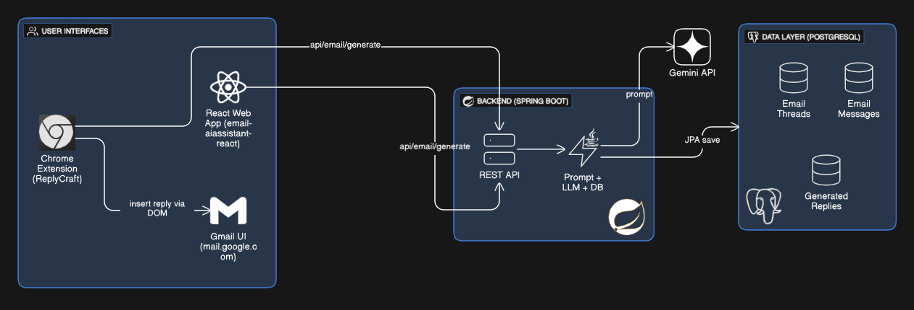

# ReplyCraft – Context-Aware AI Email Reply Assistant

**ReplyCraft** is an end-to-end AI assistant built for the **CIMBA Winter Internship Program 2026 – Problem 8**.  
It reads entire email threads and generates a smart, context-aware, tonally controlled reply using the **Gemini LLM**.

This project includes both a **full-stack web application** and a **Chrome extension** that integrates directly into Gmail.

---

## ✨ Features

- **Context-Aware Replies**  
  Understands full email threads, including sender/receiver information.

- **Tone Selection**  
  Choose between **Formal**, **Friendly**, or **Concise**.

- **Full Persistence**  
  Stores conversation history, generated replies, and metadata using **PostgreSQL**.

- **Dual Interface**
  - **Web App (React):** For testing and usage from the browser.
  - **Chrome Extension:** Adds an **AI Reply** button inside Gmail.

---

## 🏗️ Architecture

The system uses a clean separation of concerns:

- Dedicated **backend API** for AI + DB operations  
- Independent **frontend clients** (React app & Chrome extension)




---

## 🔧 Tech Stack

| Component   | Technology                         | Description                                      |
|------------|-------------------------------------|--------------------------------------------------|
| **Frontend** | `React + Vite`, `Material UI`       | SPA interface for web usage.                     |
| **Backend**  | `Java 21`, `Spring Boot 4`, `Spring Data JPA` | REST API, database operations, LLM integration. |
| **Database** | `PostgreSQL`                       | Persistent storage for emails & replies.         |
| **AI / LLM** | `Gemini API` via `WebClient`       | Generates context-aware replies.                 |
| **Browser**  | `Chrome Extension`                 | Injects the reply assistant directly into Gmail. |

---

## 📁 Repository Structure

```text
├── email-aiassistant-react      # React frontend (web)
├── email-aiassistant-sb         # Spring Boot backend
├── email-ext                    # Chrome extension (Gmail integration)
└── .gitignore
```
# 🚀 Setup & Installation Guide

Below are the complete steps to run ReplyCraft locally.

## 1. PostgreSQL Setup
1.1 Create the Database

On Windows, run (adjust path/version if needed):
```bash
"C:\Program Files\PostgreSQL\18\bin\psql.exe" -U postgres -h localhost -p 5432
```
Inside the PostgreSQL shell:
```sql
CREATE DATABASE email_aiassistant;
\q
```
1.2 Credentials Required

Keep these ready for backend configuration:

Host: `localhost`

Port: `5432`

Database: `email_aiassistant`

Username: `postgres`

Password: `your PostgreSQL password`

## 2. Backend Setup (`email-aiassistant-sb`)

The backend handles:

REST API

Database communication

Gemini LLM calls

2.1 Configure `application.properties`

Path:
`email-aiassistant-sb/src/main/resources/application.properties`
```text
# === Gemini config ===
gemini.api.url=https://generativelanguage.googleapis.com/v1beta/models/gemini-1.5-flash:generateContent?key=
gemini.api.key=YOUR_GEMINI_API_KEY_HERE

# === PostgreSQL datasource ===
spring.datasource.url=jdbc:postgresql://localhost:5432/email_aiassistant
spring.datasource.username=postgres
spring.datasource.password=YOUR_POSTGRES_PASSWORD_HERE
spring.datasource.driver-class-name=org.postgresql.Driver

# === JPA / Hibernate ===
spring.jpa.hibernate.ddl-auto=update
spring.jpa.show-sql=false
spring.jpa.properties.hibernate.format_sql=true
```
2.2 Build & Run Backend
```bash
cd email-aiassistant-sb

mvn clean install

mvn spring-boot:run
```
Expected logs:

`Tomcat started on port 8080`

Hibernate initialized without DB errors

Main API Endpoint:
`POST http://localhost:8080/api/email/generate`

## 3. Frontend Setup (`email-aiassistant-react`)
3.1 Install Dependencies
```bash
cd email-aiassistant-react
npm install
```
3.2 Verify API URL
Ensure your React frontend calls:
```text
http://localhost:8080/api/email/generate
```
Update this if you changed the backend port.

3.3 Run the Web App
```bash
npm run dev
```
🟢 Web App URL: `http://localhost:5173`

## 4. Chrome Extension Setup (`email-ext`)

The extension integrates ReplyCraft directly into Gmail.

4.1 Check Backend URL in `content.js`

Verify that the `fetch` call inside `email-ext/content.js` points to your backend:
```text
http://localhost:8080/api/email/generate
```
4.2 Load the Extension in Chrome

Open `chrome://extensions`

Toggle Developer mode ON (top right)

Click Load unpacked

Select the `email-ext` folder

You should see:
**ReplyCraft – Email Writer Assistant**

4.3 Using the Extension

Ensure the backend is running (`email-aiassistant-sb`)

Open Gmail

Click Reply or Reply All

The AI Reply button is injected in the compose toolbar

Choose a Tone, click Generate reply

Click Insert into reply to paste it into Gmail’s editor

## 📈 Future Improvements 

Potential next steps and extensions:

Authentication & User History:
Add user login/sign-up and expose a /history endpoint + UI to browse past replies.

Security & Scalability:
Implement rate limiting, structured logging, and production-ready monitoring.

Containerization:
Dockerize Postgres + Backend + Frontend for easy deployment and environment parity.

Provider Agnostic Support:
Extend support to other email providers (Outlook, Yahoo, enterprise mail systems).

Custom Prompting:
Allow users to add custom instructions (e.g., “Ask about their availability next week”).

